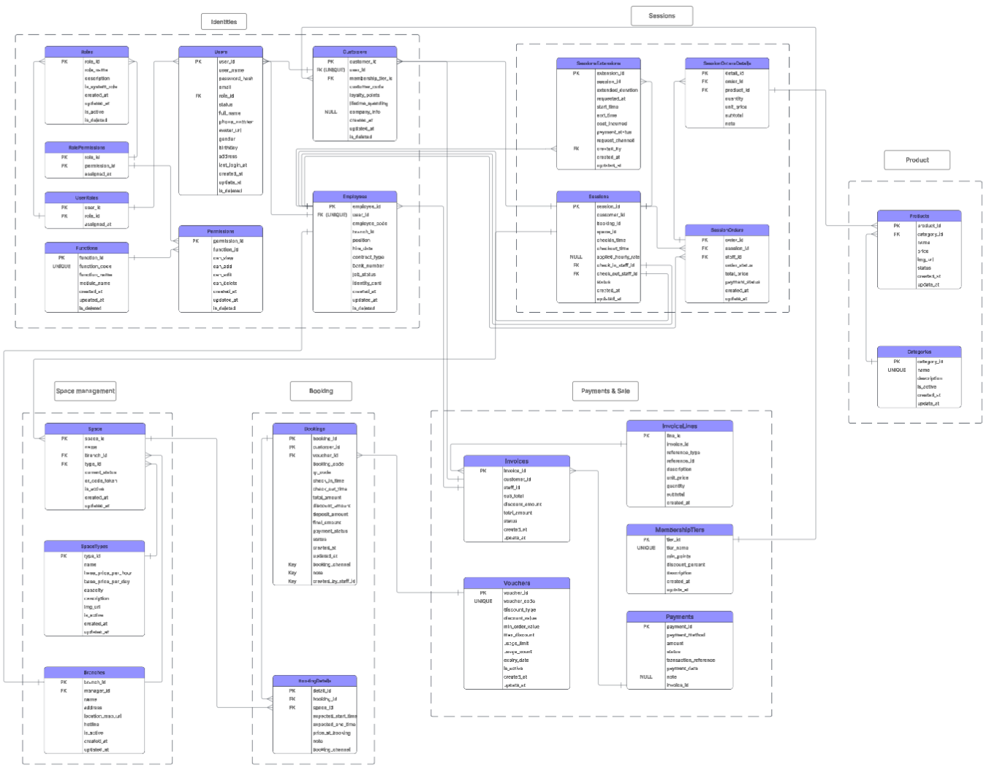

# 🏢 Hệ thống Quản lý Không gian Làm việc & Học tập (Workspace Management System)

## 📖 Giới thiệu 
Dự án này cung cấp giải pháp phần mềm toàn diện cho việc quản lý và vận hành chuỗi không gian làm việc/học tập. Hệ thống giải quyết trọn vẹn bài toán vận hành Online to Offline, từ khâu khách hàng đặt chỗ trực tuyến/tại quầy, quản lý thời gian sử dụng thực tế, gọi món F&B, cho đến thanh toán tổng hợp, áp dụng khuyến mãi thành viên và dọn dẹp không gian.

---

## 🗄 Sơ đồ Thực thể Liên kết (ERD)
Sơ đồ dưới đây mô tả kiến trúc cơ sở dữ liệu cốt lõi của toàn bộ hệ thống. 

  
   
  <i>(Click trực tiếp vào ảnh để mở chế độ toàn màn hình và phóng to chi tiết)</i>

---

## ⚙️ Kiến trúc Cơ sở Dữ liệu & Quy trình Vận hành
Hệ thống xoay quanh 6 phân hệ cốt lõi được ánh xạ chặt chẽ vào cơ sở dữ liệu, kết hợp với các luồng tự động hóa (Database Automation) để tối ưu vận hành:

### 1. Phân hệ Quản lý Đặt chỗ (Booking Management)
* **Luồng Đặt chỗ Đa kênh:** Hỗ trợ lưu trữ thông tin cho cả luồng `ONLINE` (Khách tự đặt qua App) và `OFFLINE` (Lễ tân thao tác tại quầy). Hỗ trợ lưu thông tin cho Khách thành viên lẫn Khách vãng lai.
* **Snapshot Giá:** Giá trị thuê tại thời điểm đặt luôn được snapshot vào `price_at_booking` trong `BookingDetails` để tránh rủi ro biến động giá trong tương lai.
* **Tự động hóa Giữ chỗ:** Khi đơn đặt chỗ chuyển sang trạng thái `BOOKED`, hệ thống tự động khóa trạng thái vật lý của không gian (`Spaces`) sang `BOOKED` để ngăn trùng lịch. Nếu đơn bị `CANCELLED`, hệ thống lập tức nhả không gian về `AVAILABLE`.

### 2. Phân hệ Phiên làm việc & Trạng thái Không gian (Sessions & Spaces)
Đây là phân hệ tách bạch hoàn toàn dữ liệu giao dịch tĩnh (Booking) và vòng đời sử dụng thực tế (Session).
* **Check-in:** Lễ tân tạo `Sessions` mới. Ngay lập tức, không gian chuyển sang `OCCUPIED` (Có người ngồi). Đồng thời, đơn Booking gốc sẽ được đồng bộ ngược thành `ACTIVE` và ghi nhận `check_in_time`.
* **Check-out:** Khi ghi nhận `checkout_time`, không gian tự động chuyển sang trạng thái chờ dọn dẹp (`CLEANING`). Đơn đặt chỗ hoàn tất với trạng thái `COMPLETED`, và trạng thái của chính Session đó cũng tự động được đóng lại (`COMPLETED`).

### 3. Phân hệ F&B và Gia hạn (Services & Extensions)
* **Tính toán Order Tự động:** Khi khách hàng gọi thêm món, thay đổi số lượng hoặc hủy món trong `SessionOrderDetails`, hệ thống tự động tính thành tiền (`subtotal = quantity * unit_price`) và tự động dùng thuật toán delta (cộng/trừ chênh lệch) để cập nhật tổng hóa đơn (`total_price`) vào `SessionOrders` mà không làm nghẽn hệ thống.
* **Quản lý Gia hạn:** Mọi chi phí phát sinh khi khách ngồi lố giờ được ghi log chi tiết trong `SessionExtensions`.

### 4. Phân hệ Thanh toán & Khuyến mãi (Payment, Loyalty & Vouchers)
* **Tính toán Chiết khấu Đa tầng:** Hàm `fn_CalculateDiscountAmount` xử lý logic phức tạp để tổng hợp mức giảm giá từ cả Hạng Thành Viên (`MembershipTiers`) lẫn Mã giảm giá (`Vouchers` - dạng `%` hoặc tiền cố định), có tính toán chặn trần `max_discount`.
* **Cập nhật Điểm & Thăng hạng Tự động:** Ngay khi một giao dịch trong `Payments` chuyển trạng thái `SUCCESS`:
  * Hệ thống tự động tính toán và cộng dồn điểm thưởng (`loyalty_points`) dựa trên số tiền chi tiêu.
  * Quét bảng `MembershipTiers` để tự động nâng hạng thành viên nếu đủ điều kiện.
  * Tự động quét các InvoiceLines thuộc giao dịch để truy xuất và cộng dồn lượt sử dụng (`used_count`) vào đúng mã Voucher đã dùng nhằm ngăn chặn vượt quá `usage_limit`.

### 5. Phân hệ Danh tính & Phân quyền (Identities & Roles)
* Thiết kế theo cấu trúc phân quyền Role-Based Access Control (RBAC) với các bảng `Roles`, `Permissions`, `RolePermissions`.
* Tách biệt dữ liệu `Users` cốt lõi với thông tin mở rộng của `Employees` và `Customers` theo mô hình Table-Per-Type.

### 6. Khả năng Audit & Data Pipeline Ready
* Toàn bộ các bảng dữ liệu có tính chất giao dịch (Bookings, Sessions, Invoices,...) đều được gắn Trigger tự động cập nhật `updated_at = CURRENT_TIMESTAMP` trước mỗi lệnh UPDATE. Kiến trúc này giúp cơ sở dữ liệu luôn sẵn sàng cho các tiến trình trích xuất dữ liệu gia tăng (Incremental ETL) trong các bài toán Data Warehouse và Big Data.